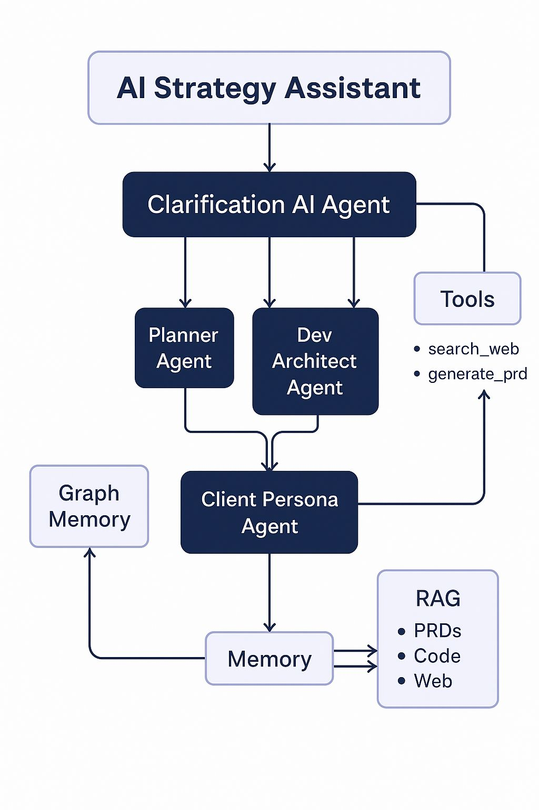

# AI Strategy Assistant



An AI-powered tool that helps you plan and architect software projects by generating comprehensive project plans, technical architectures, and gathering feedback from different stakeholder personas.

> **Recent Updates**
> - Migrated from deprecated LangChain imports to `langchain-openai` and `langchain-community`
> - Updated all agents to use `ChatOpenAI` with proper message formatting for OpenRouter API
> - Fixed various runtime errors and improved error handling
> - Added proper type hints and documentation

## Features

- **Clarification Agent**: Asks clarifying questions to better understand project requirements
- **Planning Agent**: Generates detailed project plans with tasks, timelines, and dependencies
- **Technical Architect**: Designs system architecture and technology stack
- **Client Persona Feedback**: Simulates feedback from different stakeholder personas (CTO, Business Owner, End User, etc.)
- **Interactive Web UI**: User-friendly interface built with Streamlit
- **RESTful API**: Backend service built with FastAPI for easy integration

## Prerequisites

- Python 3.9+
- pip (Python package manager)
- OpenRouter API key (get one from [OpenRouter](https://openrouter.ai/))

## Installation

1. Clone the repository:
   ```bash
   git clone https://github.com/yourusername/ai-strategy-assistant.git
   cd ai-strategy-assistant
   ```

2. Create a virtual environment and activate it:
   ```bash
   python -m venv venv
   source venv/bin/activate  # On Windows: venv\Scripts\activate
   ```

3. Install the required dependencies:
   ```bash
   pip install -r requirements.txt
   ```

4. Set up environment variables:
   Create a `.env` file in the project root and add your OpenRouter API key:
   ```
   OPENROUTER_API_KEY=your_openrouter_api_key_here
   OPENROUTER_MODEL=openai/gpt-4-turbo-preview  # or any other supported model
   ```

## Usage

### Running the API Server

1. Start the FastAPI server:
   ```bash
   uvicorn api:app --reload
   ```
   The API will be available at `http://localhost:8000`

2. Access the API documentation at `http://localhost:8000/docs`

### Running the Web UI

1. In a new terminal, activate the virtual environment and start the Streamlit app:
   ```bash
   source venv/bin/activate  # On Windows: venv\Scripts\activate
   streamlit run app.py
   ```

2. Open your browser and navigate to `http://localhost:8501`

### Using the API Directly

You can also interact with the API directly using `curl` or any HTTP client:

```bash
# Submit a new request
curl -X POST "http://localhost:8000/process" \
  -H "Content-Type: application/json" \
  -d '{"user_input": "I want to build a task management application"}'

# Check request status
curl "http://localhost:8000/status/REQUEST_ID"

# Get results
curl "http://localhost:8000/results/REQUEST_ID"
```

## Project Structure

```
ai-strategy-assistant/
├── agents/                    # Agent implementations
│   ├── __init__.py
│   ├── clarification_agent.py # Clarification agent
│   ├── planner_agent.py       # Planning agent
│   ├── dev_architect_agent.py # Technical architect
│   └── client_persona_agent.py # Client persona feedback
├── api.py                    # FastAPI application
├── app.py                    # Streamlit web UI
├── agent_orchestrator.py     # Agent workflow orchestration
├── requirements.txt          # Python dependencies
├── .env.example             # Example environment variables
└── README.md                # This file
```

## Configuration

You can configure the application by setting the following environment variables:

- `OPENROUTER_API_KEY`: Your OpenRouter API key (required)
- `API_BASE_URL`: Base URL for the API (default: `http://localhost:8000`)
- `LOG_LEVEL`: Logging level (default: `INFO`)

## Development

### Code Style

This project uses:
- Black for code formatting
- isort for import sorting
- flake8 for linting

Run the following commands to format and check the code:

```bash
# Format code with black
black .

# Sort imports with isort
isort .

# Lint with flake8
flake8
```

### Testing

Run the test suite with pytest:

```bash
pytest
```

## License

This project is licensed under the MIT License - see the [LICENSE](LICENSE) file for details.

## Acknowledgements

- [LangChain](https://www.langchain.com/) for AI agent orchestration
- [FastAPI](https://fastapi.tiangolo.com/) for the API framework
- [Streamlit](https://streamlit.io/) for the web UI
- [OpenRouter](https://openrouter.ai/) for LLM API access